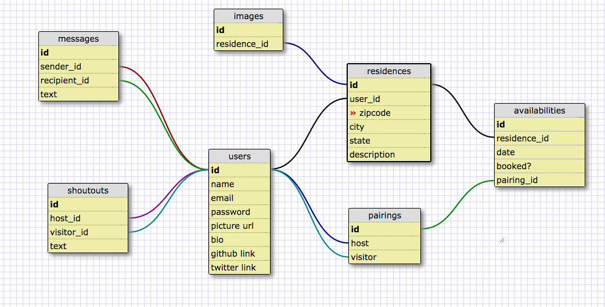

PairBnB
=======

AirBnB but for Programmers in #realtime #agile #dynamicenvironments

To Use
=======
```
 git clone https://github.com/mjsteichen/PairBnB.git
 cd PairBnB
 bundle install
 rake db:create && rake db:migrate && rake db:seed
 rails server
```

Project Description
=======

PairBnB makes it possible for programmers to network, learn from, teach and host like-minded individuals.

PairBnb facilitates networking within the tech industry and help programmers who are looking to travel and spread their knowledge. Users can offer their technical expertise in exchange for a place to stay. The goal is to help programmers who believe in open source code and the benefits of pair programming.

Schema
=======



Team
=======
Nick Brown - @nick-brown2014

Emily Owaki - @jabbowaki

Michael Steichen - @mjsteichen
